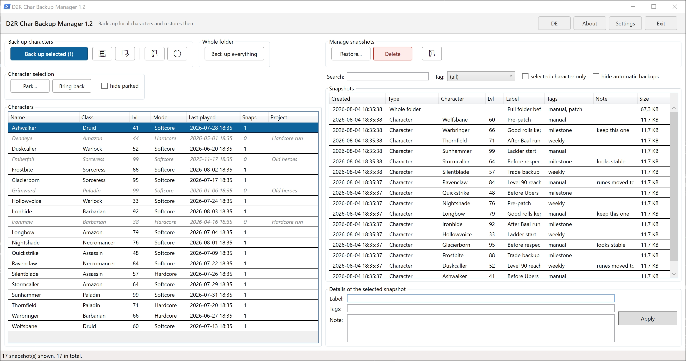

# D2R Char Backup Manager

A desktop tool for backing up, organising and restoring local *Diablo II:
Resurrected* characters. PowerShell + WPF, no installation, no server, no
background process.



Works with **offline characters only**. Online characters live on Blizzard's
servers and cannot be backed up from outside.

## Open source, and meant to be read

The entire program is **one PowerShell file in plain text**. Nothing is compiled,
nothing is obfuscated, nothing is minified. Before you let it near your save games
you can read every line it will execute — and you do not need to be a programmer
for the parts that matter: search the file for `Remove-Item` and you have found all
five places where anything is ever deleted.

That is not a side effect of how it was built; it is the reason it was built this
way. The same thinking runs through the whole design: backups are stored as
ordinary folders instead of archives, so you can reach them with Explorer alone,
and every backup carries an `_INFO.txt` explaining how to restore it by hand
without this program.

The [transparency section](#transparency-privacy-antivirus-and-your-account) below
answers what people ask first: does it phone home, does it touch the game, and can
it get an account banned.

### Written with AI assistance

This program was developed together with an AI assistant (Claude), which is why
every commit carries a `Co-Authored-By` line. Saying so here rather than leaving it
to be discovered seemed the only honest option for a project whose whole pitch is
that you can check it yourself.

What that does and does not mean: the design decisions — folders instead of
archives, a mandatory backup before parking, no automatic cleanup — were made by a
human who uses the tool on his own characters. The 97 automated checks exist
precisely because generated code needs evidence rather than trust, and the risky
paths were additionally run against a real save folder and confirmed inside the
game. None of that makes the code correct by decree; it is the reason it can be
checked at all.

## What it does

- **Back up** a single character, several at once, or the entire save folder in
  one piece. Every character backup includes the shared stash.
- **Restore**, optionally **under a different name** — which creates a copy as a
  new character instead of overwriting the original.
- **Park** characters: move them out of the D2R character selection without
  deleting them. Useful once the list in the game has grown too long to scroll.
- **Label** every backup with a name, tags and a note; search and filter by them.
- **Safety copy** taken automatically before every restore, so there is always a
  way back.

The interface is available in **English and German** and switches at the press of
a button.

## Requirements

Windows 10 or 11. Nothing to install — Windows PowerShell is already part of
Windows. No .NET download, no Python, no administrator rights.

## Getting started

1. Download the ZIP from the releases page and unpack it wherever you like.
2. Double-click **`Start D2R Char Backup Manager.cmd`**.

There is nothing to configure. The program finds the save folder through the
registry and stores its backups in a `Backups` subfolder next to itself.

> If the ZIP came from the internet, Windows blocks it. Right-click the ZIP →
> *Properties* → tick **Unblock** → *OK*, then unpack.

On first start a notice about liability appears that has to be accepted once.

## How backups are stored

**Plain folders with uncompressed files — deliberately not ZIP archives.**

```
<backup folder>\
  _LIESMICH.txt
  index.json                                     labels, tags, notes
  Charaktere\<name>\<date_time> Lvl<n> <class>\
      _INFO.txt, the save files, SharedStash\
  Kompletter Ordner\<date_time>\
      _INFO.txt, every file except the online leftovers (*.ctlo, *.keyo)
```

> **Why are those folder names German?** `Charaktere` ("characters"),
> `Kompletter Ordner` ("whole folder"), `SharedStash` and `_LIESMICH.txt`
> ("readme") keep their names in the English interface as well. They are fixed on
> purpose: if they were translated, switching the language would create a second
> folder tree, and backups made in one language would be invisible in the other.
> The *contents* of `_LIESMICH.txt` and of every `_INFO.txt` do follow the
> interface language.

You should be able to see in Explorer what was backed up and when, and to copy it
back **without this program** if you ever need to. Every backup carries an
`_INFO.txt` with all the details and step-by-step instructions for restoring it by
hand. If `index.json` is ever lost, the backups stay usable — only the labels are
gone.

The cost compared to ZIP is roughly four times the disk space. That is the trade
this project deliberately makes.

## Parking characters

D2R only lists `.d2s` files that sit **directly** in the save folder; anything in a
subfolder is invisible to the game. Parking uses exactly that: the character's file
set is moved to `_Projekte\<project>\` inside the save folder. Nothing is deleted,
nothing is rewritten.

Parked characters stay visible inside the program — greyed out and italic, with
their project in the last column — so you never lose track of what you put away.
You can see four of them in the screenshot at the top: *Deadeye* and *Ironmaw* in
"Hardcore run", *Emberfall* and *Grimward* in "Old heroes". Bringing them back is
the same move in reverse.

**A backup of every character is taken before parking it, and this cannot be
switched off.** A backup is a copy; a parked character is the original in a
different place. Delete the project folder and it is gone.

## Safety

- The program checks whether D2R is running and **blocks** restoring and parking
  while it is. The game keeps its save files open and writes them back on exit.
- Backing up is always allowed, including while playing — such a backup is tagged
  automatically, because the saved state may lag behind what is happening in game.
- Renaming is safe: in D2R the character name is **not** stored inside the `.d2s`
  file. It comes from the file name alone, so restoring under a new name is pure
  renaming — no binary editing, no checksum recalculation.
- The shared stash belongs to all characters together. It is always included in a
  backup, never restored unless you ask, and never moved when parking.

## Transparency: privacy, antivirus and your account

Everything in this section can be checked in the source — that is the point of
shipping a readable script rather than a compiled program.

### It never goes online

There is no network code in it at all: no web requests, no downloads, no sockets,
no telemetry, no update check, no analytics. Nothing about you or your characters
leaves the machine. The ten `http://` strings in the source are XML namespace
identifiers of the interface description — names, never fetched.

`config.json` holds your own folder paths and your settings and stays next to the
program.

One thing worth knowing: if you point the backup folder at a cloud-synced location
such as OneDrive or Dropbox, your save games go into that cloud. That is your
choice, not something the program does on its own.

### It does not touch the game

The only question the program ever asks about *Diablo II: Resurrected* is whether
the process is running, so it can refuse to move files underneath a running game.
It never reads or writes the game's memory, never injects anything, never starts or
stops it. It only ever touches files on disk.

### Can this get my account banned?

Honest answer, in two halves.

**It cannot reach online characters at all.** Ladder and other online characters
live on Blizzard's servers; nothing on your disk represents them, so there is
nothing here to back up, restore or park. This works exclusively on the local files
of offline characters.

**But restoring an old save is still a change to your save game.** Nobody can
promise you what Blizzard makes of that. If you play online and care about your
account, keep in mind that this tool is for your local characters — and that using
it is your decision, as the notice on first start says.

### Why does my antivirus get nervous?

Because it is a PowerShell script that copies files, and malicious scripts do the
same thing. There is no way to look harmless to a heuristic and still do the job.

Better than trusting a promise: **read it.** It is a single plain text file. Search
for `Remove-Item` and you will find all five places where anything is deleted, or
`Copy-Item` and `Move-Item` for every place files are moved.

The program carries no code signature, so Windows SmartScreen may warn about an
unknown publisher. A certificate costs real money every year, which is hard to
justify for a tool given away for free.

### Why does the launcher say `-ExecutionPolicy Bypass`?

Windows refuses to run unsigned PowerShell scripts by default. The flag lifts that
**for this one launch only**. It changes no setting, writes nothing to the registry
and leaves the policy on your system exactly as it was. Close the program and
nothing of it stays active.

### What it does to your disk

Backups are never cleaned up automatically — deliberately, so that nothing
disappears behind your back. A character backup costs about **100 KB** on average;
measured across 72 real backups the range was 12 KB to 430 KB, depending on how
many map files a character has. That is written on every press of the button, even
when nothing changed. Backing up after each session, expect a few hundred megabytes
over a year, and delete old backups yourself when you want the space back.

Every backup also records in its `_INFO.txt` which folder it came from. If you ever
hand a backup folder to someone else, your Windows user name travels along in that
path.

## Documentation

| File | For whom |
|---|---|
| [INSTRUCTIONS.md](INSTRUCTIONS.md) | end users, English |
| [ANLEITUNG.md](ANLEITUNG.md) | end users, German |
| [ENTWICKLUNG.md](ENTWICKLUNG.md) | maintaining the code — German, including the `.d2s` header layout and the traps that already cost blood |
| [CHANGELOG.md](CHANGELOG.md) | what changed in which version |

## Building and testing

```
powershell.exe -NoProfile -ExecutionPolicy Bypass -Sta -File "Test-Sandbox.ps1"
```

97 checks covering header parsing, backing up, restoring, renaming, the folder
layout, stash behaviour, safety copies, deleting, parking and bringing back. They
run against a throwaway sandbox under `%TEMP%` and never touch a real save folder.
Green under Windows PowerShell 5.1 **and** PowerShell 7.4.

`Build-Deploy.ps1` produces the distributable ZIP.

## Licence

**MIT** — see [LICENSE](LICENSE). Free software in the plain sense: use it, change
it, pass it on, build something else from it. The only condition is that the
copyright notice travels along. It comes with no warranty, which is the other half
of "free".

This project is not affiliated with, endorsed by or reviewed by Blizzard
Entertainment. *Diablo II: Resurrected* and all related names are trademarks of
their respective owners.
