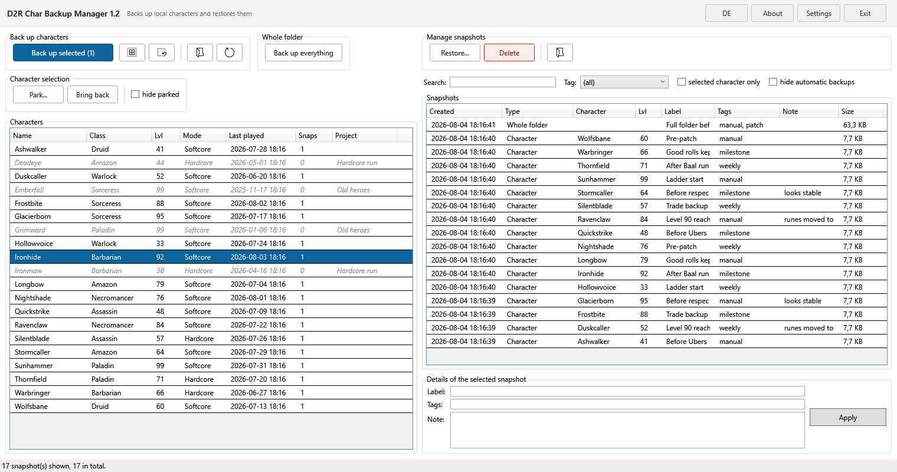
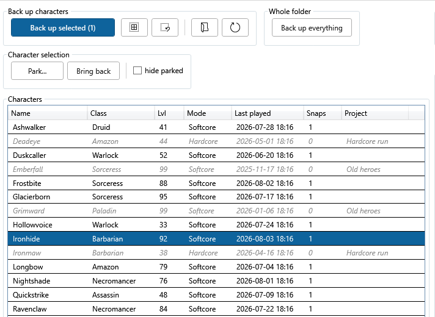

# D2R Char Backup Manager

A desktop tool for backing up, organising and restoring local *Diablo II:
Resurrected* characters. PowerShell + WPF, no installation, no server, no
background process.



Works with **offline characters only**. Online characters live on Blizzard's
servers and cannot be backed up from outside.

## What it does

- **Back up** a single character, several at once, or the entire save folder in
  one piece. Every character backup includes the shared stash.
- **Restore**, optionally **under a different name** — which creates a copy as a
  new character instead of overwriting the original.
- **Park** characters: move them out of the D2R character selection without
  deleting them. Useful once the list in the game has grown too long to scroll.
- **Label** every backup with a name, tags and a note; search and filter by them.
- **Safety copy** taken automatically before every restore, so there is always a
  way back.

The interface is available in **English and German** and switches at the press of
a button.

## Requirements

Windows 10 or 11. Nothing to install — Windows PowerShell is already part of
Windows. No .NET download, no Python, no administrator rights.

## Getting started

1. Download the ZIP from the releases page and unpack it wherever you like.
2. Double-click **`Start D2R Char Backup Manager.cmd`**.

There is nothing to configure. The program finds the save folder through the
registry and stores its backups in a `Backups` subfolder next to itself.

> If the ZIP came from the internet, Windows blocks it. Right-click the ZIP →
> *Properties* → tick **Unblock** → *OK*, then unpack.

On first start a notice about liability appears that has to be accepted once.

## How backups are stored

**Plain folders with uncompressed files — deliberately not ZIP archives.**

```
<backup folder>\
  _LIESMICH.txt
  index.json                                     labels, tags, notes
  Charaktere\<name>\<date_time> Lvl<n> <class>\
      _INFO.txt, the save files, SharedStash\
  Kompletter Ordner\<date_time>\
      _INFO.txt, all files
```

> **Why are those folder names German?** `Charaktere` ("characters"),
> `Kompletter Ordner` ("whole folder"), `SharedStash` and `_LIESMICH.txt`
> ("readme") keep their names in the English interface as well. They are fixed on
> purpose: if they were translated, switching the language would create a second
> folder tree, and backups made in one language would be invisible in the other.
> The *contents* of `_LIESMICH.txt` and of every `_INFO.txt` do follow the
> interface language.

You should be able to see in Explorer what was backed up and when, and to copy it
back **without this program** if you ever need to. Every backup carries an
`_INFO.txt` with all the details and step-by-step instructions for restoring it by
hand. If `index.json` is ever lost, the backups stay usable — only the labels are
gone.

The cost compared to ZIP is roughly four times the disk space. That is the trade
this project deliberately makes.

## Parking characters

D2R only lists `.d2s` files that sit **directly** in the save folder; anything in a
subfolder is invisible to the game. Parking uses exactly that: the character's file
set is moved to `_Projekte\<project>\` inside the save folder. Nothing is deleted,
nothing is rewritten.

Parked characters stay visible inside the program — greyed out and italic, with
their project in the last column — so you never lose track of what you put away.
Bringing them back is the same move in reverse.



**A backup of every character is taken before parking it, and this cannot be
switched off.** A backup is a copy; a parked character is the original in a
different place. Delete the project folder and it is gone.

## Safety

- The program checks whether D2R is running and **blocks** restoring and parking
  while it is. The game keeps its save files open and writes them back on exit.
- Backing up is always allowed, including while playing — such a backup is tagged
  automatically, because the saved state may lag behind what is happening in game.
- Renaming is safe: in D2R the character name is **not** stored inside the `.d2s`
  file. It comes from the file name alone, so restoring under a new name is pure
  renaming — no binary editing, no checksum recalculation.
- The shared stash belongs to all characters together. It is always included in a
  backup, never restored unless you ask, and never moved when parking.

## Documentation

| File | For whom |
|---|---|
| [INSTRUCTIONS.md](INSTRUCTIONS.md) | end users, English |
| [ANLEITUNG.md](ANLEITUNG.md) | end users, German |
| [ENTWICKLUNG.md](ENTWICKLUNG.md) | maintaining the code — German, including the `.d2s` header layout and the traps that already cost blood |
| [CHANGELOG.md](CHANGELOG.md) | what changed in which version |

## Building and testing

```
powershell.exe -NoProfile -ExecutionPolicy Bypass -Sta -File "Test-Sandbox.ps1"
```

92 checks covering header parsing, backing up, restoring, renaming, the folder
layout, stash behaviour, safety copies, deleting, parking and bringing back. They
run against a throwaway sandbox under `%TEMP%` and never touch a real save folder.
Green under Windows PowerShell 5.1 **and** PowerShell 7.4.

`Build-Deploy.ps1` produces the distributable ZIP.

## Licence

MIT — see [LICENSE](LICENSE).

This project is not affiliated with, endorsed by or reviewed by Blizzard
Entertainment. *Diablo II: Resurrected* and all related names are trademarks of
their respective owners.
